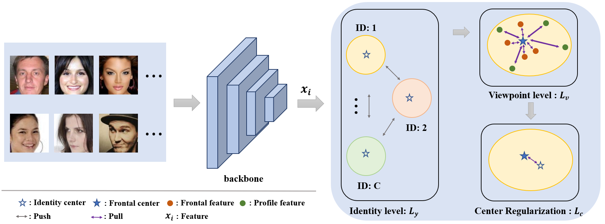

# FCGFace
This project is the official `PyTorch` implementation of "[Frontal-Centers Guided Face: Boosting Face Recognition by Learning Pose-Invariant Features](https://ieeexplore.ieee.org/abstract/document/9796565)", T-IFS 2022


> **Abstract:** In recent years, face recognition has made a remarkable breakthrough due to the emergence of deep learning. However, compared with frontal face recognition, plenty of deep face recognition models still suffer serious performance degradation when handling profile faces. To address this issue, we propose a novel Frontal-Centers Guided Loss (FCGFace) to obtain highly discriminative features for face recognition. Most existing discriminative feature learning approaches project features from the same class into a separated latent subspace. These methods only model the distribution at the identity-level but ignore the latent relationship between frontal and profile viewpoints. Different from these methods, FCGFace takes viewpoints into consideration by modeling the distribution at both the identity-level and the viewpoint-level. At the identity-level, a softmax-based loss is employed for a relatively rough classification. At the viewpoint-level, centers of frontal face features are defined to guide the optimization conducted in a more refined way. Specifically, our FCGFace is capable of adaptively adjusting the distribution of profile face features and narrowing the gap between them and frontal face features during different training stages to form compact identity clusters. Extensive experimental results on popular benchmarks, including cross-pose datasets (CFP-FP, CPLFW, VGGFace2-FP, and Multi-PIE) and non-cross-pose datasets (YTF, LFW, AgeDB-30, CALFW, IJB-B, IJB-C, and RFW), have demonstrated the superiority of our FCGFace over the SOTA competitors.

<p align="center">

</p>

## requirements
```
torch
numpy
opencv-python
bcolz
tqdm
scipy
scikit-learn
```

## Data Preparing

1. The training datasets, CASIA-WebFace and MS1M-IBUG are downloaded from Data Zoo of [InsightFace](https://github.com/deepinsight/insightface).
2. The test datasets, including LFW, CFP, AgeDB, CALFW, CPLFW and VGG-FP are downloaded from [face.evoLVe](https://github.com/ZhaoJ9014/face.evoLVe).

## Face Alignment

We use MTCNN to align images in training sets before training.

## Train

Modify the 'config.py' file and then run the code for training:
python3 train.py

## Test

Modify the 'config.py' file to add the ckpt path as "BACKBONE_RESUME_ROOT" before evaluation:

1. Perform Evaluation on LFW, CFP_FF, CFP_FP, AgeDB, CALFW, CPLFW and VGG2_FP

python3 test.py

2. Perform Evaluation on IJB benchmark

Please refer to [[InsightFace](https://github.com/deepinsight/insightface)](https://github.com/deepinsight/insightface)


## Citation
If you find this repo useful for your research, please consider citing the paper
```
@ARTICLE{9796565,
  author={Tao, Yingfan and Zheng, Wenxian and Yang, Wenming and Wang, Guijin and Liao, Qingmin},
  journal={IEEE Transactions on Information Forensics and Security}, 
  title={Frontal-Centers Guided Face: Boosting Face Recognition by Learning Pose-Invariant Features}, 
  year={2022},
  volume={17},
  number={},
  pages={2272-2283},
  keywords={Face recognition;Measurement;Representation learning;Feature extraction;Training;Optimization;Generative adversarial networks;Face recognition;metric learning;pose-invariant features learning},
  doi={10.1109/TIFS.2022.3183410}}
``` 

## Acknowledgement
The code is adopted from [InsightFace](https://github.com/deepinsight/insightface), [face.evoLVe](https://github.com/ZhaoJ9014/face.evoLVe) and [SFace](https://github.com/deepinsight/insightface). We sincerely appreciate for their contributions.
